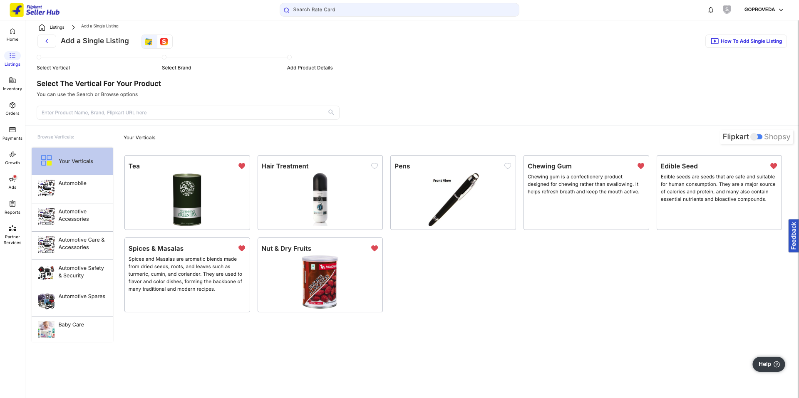
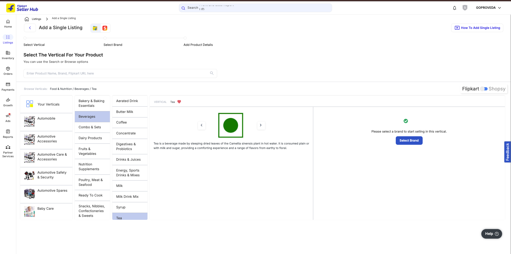
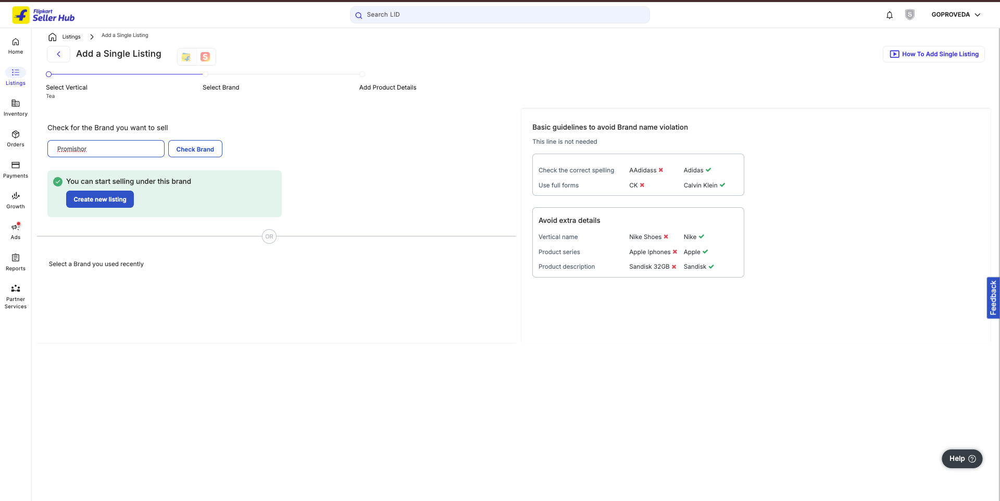
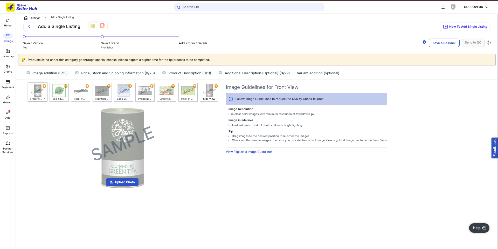
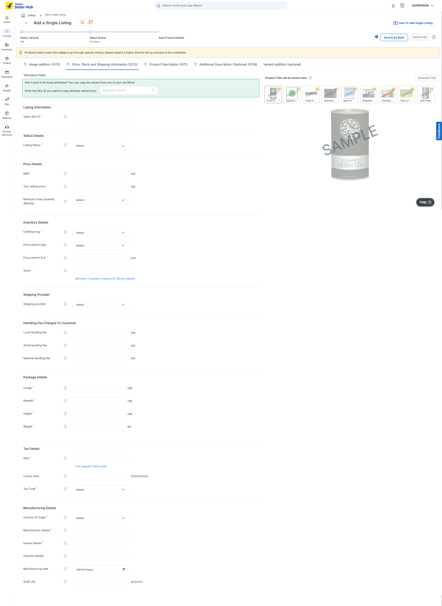
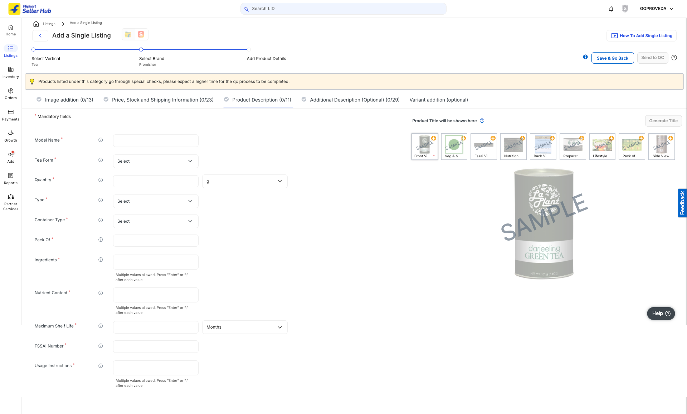
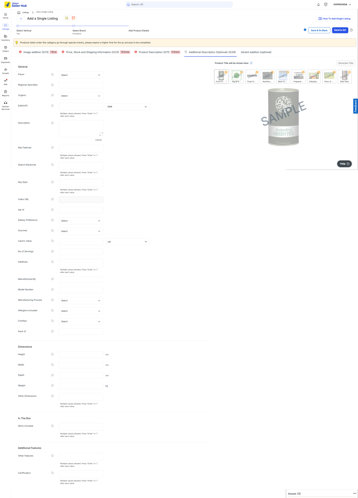
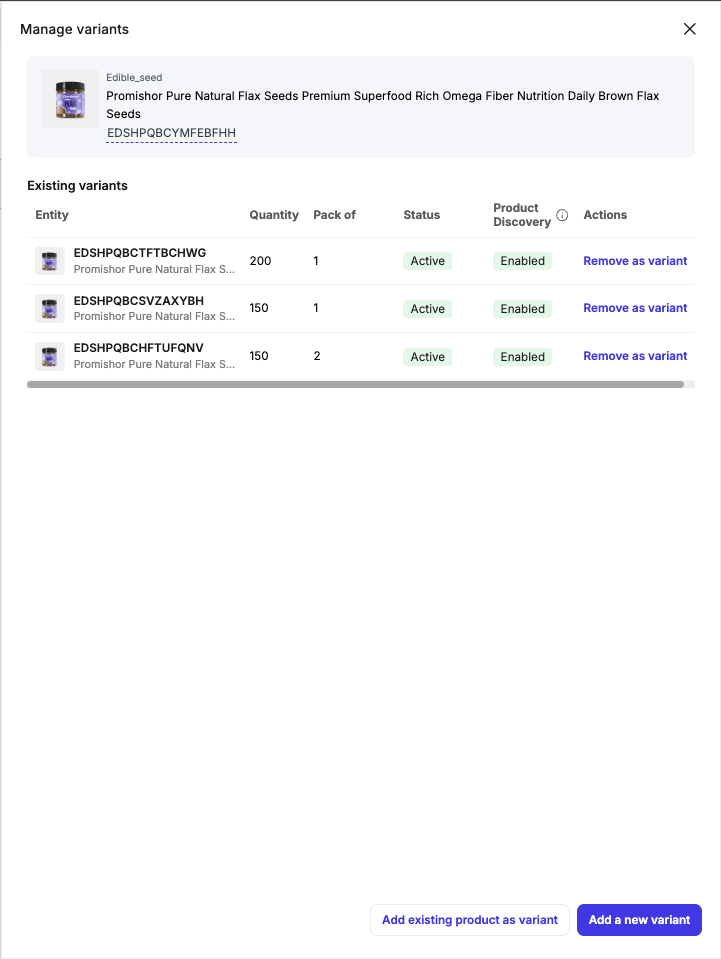
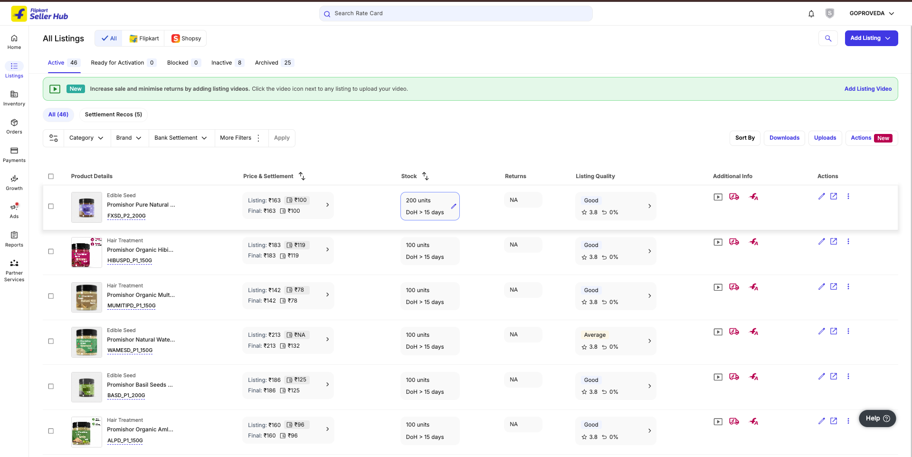

## DETAILS

495402404557a4835489949905848619a7b2

2132bcb5b495404b3d39c857c2a86ac7a

https://seller.flipkart.com/api-docs/best_practices.html

https://seller.flipkart.com/api-docs/FMSAPI.html#

https://img1a.flixcart.com/fk-api-docs/_static/images/APILicAgreement.pdf

## STEP TO CREATE LISTING

1.  - Choose Verticals

2.  - Click Select Brand

3.  - Add Search and Click Button

4.  - Images

5.  - Price, Stock and Shipping Information

6.  - Product Description

7.  - Additional Description

8.  - Variants

## Read Existing to understand the pattern for name, SKU, model or others that can be generated from AI

 - Products listed
